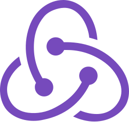
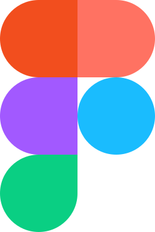

### Hi there 👋

# Hi 👋 !

## I'm Bjorn-Donald Bassey

I am a frontend and mobile developer.
Technologies which I teach and use:

### Frontend Technologies

  
  
  
  
  
  
  
  

 
  
 ### Mobile Technologies
 

  
  
   

 

### Backend Technologies

  
  
  
  
  
  

### Tools

  
  
  
  
  
   

---
<small> _I am a lifelong learner and I love teaching and inspiring people_. </small>

<!--
**bjorndonald/bjorndonald** is a ✨ _special_ ✨ repository because its `README.md` (this file) appears on your GitHub profile.

Here are some ideas to get you started:

- 🔭 I’m currently working on ...
- 🌱 I’m currently learning ...
- 👯 I’m looking to collaborate on ...
- 🤔 I’m looking for help with ...
- 💬 Ask me about ...
- 📫 How to reach me: ...
- 😄 Pronouns: ...
- ⚡ Fun fact: ...
-->
